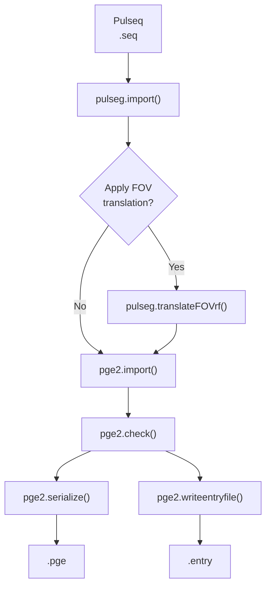

# Scanner-side Pulseq compilation for the pge2 GE interpreter

This package compiles Pulseq (.seq) files into GE-compatible .pge and .entry files on the scanner using the MATLAB Runtime. 
It performs the following Pulseq-to-GE compilation pipeline and is intended for use with the pge2 GE interpreter.

---

## Overview

The scanner compiler performs the complete Pulseq-to-GE compilation pipeline:



If an `Rx.txt` file is provided, the prescribed slice offset is applied automatically to the RF excitation before importing the sequence into the GE interpreter. This accounts for all components of the prescribed translation that cannot be achieved by scanner table motion, including through-slice offsets for oblique prescriptions. Otherwise, the original Pulseq sequence is compiled without modification. The prescribed rotation and the scanner z-axis (S/I) translation are always applied, regardless of whether an `Rx.txt` file is provided.

---

## Directory contents

The scanner compilation directory should contain the following files:

```text
compile/
├── compilePGE.sh
├── compilePGE_batch
├── run_compilePGE_batch.sh
├── compilePGE.json
├── pulseq_scans.list
├── Rx.txt          (optional)
└── *.seq
```

* `compilePGE.sh` — main compilation script
* `compilePGE_batch` and `run_compilePGE_batch.sh` — standalone MATLAB executable and launcher
* `compilePGE.json` — compilation options
* `pulseq_scans.list` — sequences to compile
* `Rx.txt (optional)` — exported scanner prescription

> [!NOTE]
> run_compilePGE_batch.sh and compilePGE_batch are generated together and should always be copied as a pair.

---

## Compilation workflow

### 1. Create a scan list

Create a text file (for example `pulseq_scans.list`) containing the Pulseq
sequences to compile:

```text
# opuser1    sequence.seq
48           gre2d.seq
49           b0.seq
50           t1map.seq
```

The `opuser1` value specifies the Pulseq interpreter slot (`pge<opuser1>.entry`)
used by the pge2 GE interpreter.

### 2. Prescribe a reference scan

Prescribe any scan on the GE scanner (either a vendor sequence or a Pulseq
sequence). This establishes the desired slice position, orientation, and table
location.

### 3. Save the prescription

```bash
printSHM > Rx.txt
```

`printSHM` exports the current scanner prescription, including the slice position, orientation, table position, and field of view. 
If `translateFOV.Rxfile` is specified in `compilePGE.json`, this information is automatically applied during compilation.

### 4. Compile all sequences

```bash
./compilePGE.sh pulseq_scans.list compilePGE.json
```

This generates one `.pge` file and one `.entry` file for every sequence listed.

### 5. Install the generated entry files

Create symbolic links (or otherwise install) the generated `.entry` files in the
GE Pulseq directory.

### 6. Run the Pulseq scans

Run the Pulseq (`pge2`) scans as usual.

---

## Configuration

Compilation is controlled by `compilePGE.json`.

### Sections

| Section | Purpose |
|---------|---------|
| `pulseg_import` | Options passed to `pulseg.import()` |
| `translateFOV` | Prescription-based FOV translation |
| `pge_opts` | Scanner hardware model passed to `pge2.opts()` |
| `pge_import` | Options passed to `pge2.import()` |
| `pge_check` | Safety-check configuration |
| `pge_serialize` | Serialization options |
| `pge_writeentryfile` | Output options |

### Important fields

| Field | Description |
|------|-------------|
| `pulseg_import.soft_delay_input_ms` | Value assigned to Pulseq soft-delay events. Required only if the sequence contains soft delays. |
| `translateFOV.Rxfile` | Scanner prescription file generated by `printSHM`. |
| `pge_opts.coil` | Gradient coil model. Determines the default values of `chronaxie`, `rheobase`, and `alpha` used by the PNS model. |
| `pge_opts.options` | Optional name-value arguments passed directly to `pge2.opts()`. Most users should leave these unchanged. Override `chronaxie`, `rheobase`, or `alpha` only when intentionally modifying the default PNS model. |
| `pge_import.grad_raster_time` | Gradient raster time passed to `pge2.import()`. |
| `pge_check.pns_weights` | Relative weighting of the x, y, and z gradient axes used during PNS estimation. |
| `pge_serialize.pislquant` | Number of ADC events used during Auto Prescan receive-gain calibration. |
| `pge_serialize.checkHash` | Verify waveform hashes after serialization. |
| `pge_writeentryfile.path` | Output directory for generated `.entry` files. |

---

## Developer notes

Instructions for building the standalone executable (`compilePGE_batch` and `run_compilePGE_batch.sh`) are available in `DEVELOPMENT.md`.

Unlike previous versions of this workflow, the scanner compiler operates
directly on Pulseq `.seq` files. No intermediate MATLAB `.mat` files are
required.

The JSON configuration is translated into the corresponding MATLAB API calls,
including construction of the scanner hardware model via `pge2.opts()`.

