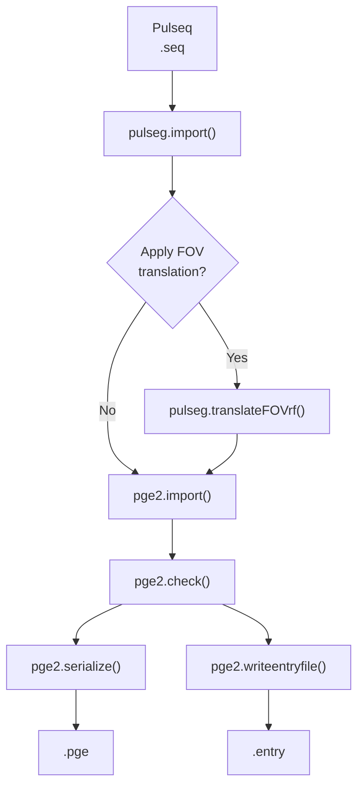

# Pulseq compilation for the pge2 GE interpreter

This package compiles Pulseq (`.seq`) files into GE-compatible `.pge` and `.entry` files for use with the pge2 GE interpreter. Compilation can be performed directly in MATLAB during development or on the scanner using the MATLAB Runtime.

---

## Overview

The compiler performs the following Pulseq-to-GE compilation pipeline:



If an `Rx.txt` file is provided, the prescribed slice offset is applied automatically to the RF excitation before importing the sequence into the GE interpreter. This accounts for all components of the prescribed translation that cannot be achieved by scanner table motion, including through-slice offsets for oblique prescriptions. Otherwise, the original Pulseq sequence is compiled without modification.

The prescribed rotation and the scanner z-axis (S/I) translation are always applied, regardless of whether an `Rx.txt` file is provided.

---

## Sequence-specific parameters

Two compilation parameters are sequence-specific and are therefore specified separately from `compilePGE.json`:

- `opuser1` — Pulseq interpreter slot used for the generated `pge<opuser1>.entry` file.
- `pislquant` — number of ADC events used during Auto Prescan receive-gain calibration.

Sequences containing Pulseq soft-delay events additionally require `soft_delay_input_ms`, which specifies the soft-delay input value in milliseconds. This parameter is omitted for sequences that do not contain soft delays.

---

## Direct compilation from MATLAB

For development and testing, a Pulseq sequence can be compiled directly from MATLAB:

```matlab
setup

opts = loadOptionsJSON('compilePGE.json');

% Disable prescription-dependent FOV translation if Rx.txt is unavailable
opts = rmfield(opts, 'translateFOV');

opuser1 = 48;
pislquant = 10;

compilePGE('gre2d.seq', opuser1, pislquant, 'gre2d.pge', opts);
```

For a sequence containing soft-delay events, specify the soft-delay input in milliseconds:

```matlab
compilePGE('gre2d.seq', opuser1, pislquant, 'gre2d.pge', opts, ...
    'soft_delay_input_ms', 700);
```

Direct MATLAB compilation is convenient when developing or modifying a sequence. It can also be used to generate the `.pge` and `.entry` files before going to the scanner when prescription-dependent RF translation is not required.

If an `Rx.txt` file is available, the `translateFOV` field can instead be retained in `opts` to apply the prescribed translation during compilation.

---

## Scanner-side compilation

The standalone compiler allows the same compilation to be performed directly on the scanner using the MATLAB Runtime.

### Compile a single sequence

To compile a single Pulseq sequence:

```bash
./compilePGE.sh gre2d.seq 48 10 gre2d.pge compilePGE.json
```

Here, `48` is `opuser1` and `10` is `pislquant`.

For a sequence containing soft-delay events:

```bash
./compilePGE.sh gre2d.seq 48 10 gre2d.pge compilePGE.json \
    --soft-delay-input-ms 700
```

To compile without prescription-dependent FOV translation:

```bash
./compilePGE.sh gre2d.seq 48 10 gre2d.pge compilePGE.json \
    --no-translate-fov
```

The optional flags can be combined when needed.

### Compile multiple sequences

Create a text file (for example `pulseq_scans.list`) containing one sequence per line:

```text
# opuser1  pislquant  soft_delay_input_ms  sequence
48         10         -                    gre2d.seq
49         12         700                  b0.seq
50         10         -                    t1map.seq
```

Use `-` for `soft_delay_input_ms` when the sequence does not contain soft-delay events.

Then compile all sequences using:

```bash
./compilePGE_batch.sh pulseq_scans.list compilePGE.json
```

This generates one `.pge` file and one `.entry` file for every sequence listed.

---

## Scanner prescription

### 1. Prescribe a reference scan

Prescribe any scan on the GE scanner (either a vendor sequence or a Pulseq sequence). This establishes the desired slice position, orientation, and table location.

### 2. Save the prescription

```bash
printSHM > Rx.txt
```

`printSHM` exports the current scanner prescription, including the slice position, orientation, table position, and field of view.

If `translateFOV.Rxfile` is specified in `compilePGE.json`, this information is automatically applied during compilation. Alternatively, prescription-dependent FOV translation can be disabled using `--no-translate-fov` when compiling a single sequence.

### 3. Install the generated entry files

Create symbolic links (or otherwise install) the generated `.entry` files in the GE Pulseq directory.

### 4. Run the Pulseq scans

Run the compiled Pulseq (`pge2`) sequences as usual.

---

## Directory contents

A scanner compilation directory may contain:

```text
compile/
├── compilePGE.sh
├── compilePGE_cli
├── run_compilePGE_cli.sh
├── compilePGE_batch.sh
├── compilePGE_batch
├── run_compilePGE_batch.sh
├── compilePGE.json
├── pulseq_scans.list
├── Rx.txt                    (optional)
└── *.seq
```

- `compilePGE.sh` — command-line interface for compiling a single sequence
- `compilePGE_cli` and `run_compilePGE_cli.sh` — standalone MATLAB executable and launcher for single-sequence compilation
- `compilePGE_batch.sh` — command-line interface for batch compilation
- `compilePGE_batch` and `run_compilePGE_batch.sh` — standalone MATLAB executable and launcher for batch compilation
- `compilePGE.json` — shared compilation options
- `pulseq_scans.list` — sequence-specific parameters and sequence filenames for batch compilation
- `Rx.txt` *(optional)* — scanner prescription exported using `printSHM`
- `*.seq` — Pulseq sequence files

> [!NOTE]
> Each standalone executable and its corresponding `run_*.sh` launcher are generated together and should always be copied as a pair.

---

## Configuration

Shared compilation options are controlled by `compilePGE.json`. The same configuration file is used for direct MATLAB compilation and scanner-side compilation.

Sequence-specific parameters (`opuser1`, `pislquant`, and, when needed, `soft_delay_input_ms`) are supplied separately as described above.

### Sections

| Section | Purpose |
|---------|---------|
| `translateFOV` | Prescription-based FOV translation |
| `pge_opts` | Scanner hardware model passed to `pge2.opts()` |
| `pge_import` | Options passed to `pge2.import()` |
| `pge_check` | Safety-check configuration |
| `pge_serialize` | Serialization options |
| `pge_writeentryfile` | Output options |

### Important fields

| Field | Description |
|------|-------------|
| `translateFOV.Rxfile` | Scanner prescription file generated by `printSHM`. |
| `pge_opts.coil` | Gradient coil model. Determines the default values of `chronaxie`, `rheobase`, and `alpha` used by the PNS model. |
| `pge_opts.options` | Optional name-value arguments passed directly to `pge2.opts()`. Most users should leave these unchanged. Override `chronaxie`, `rheobase`, or `alpha` only when intentionally modifying the default PNS model. |
| `pge_import.grad_raster_time` | Gradient raster time passed to `pge2.import()`. |
| `pge_check.pns_weights` | Relative weighting of the x, y, and z gradient axes used during PNS estimation. |
| `pge_serialize.checkHash` | Verify waveform hashes after serialization. |
| `pge_writeentryfile.path` | Output directory for generated `.entry` files. |

---

## Developer notes

Instructions for building the standalone executables and setting up a compatible MATLAB R2022a development environment are available in `DEVELOPMENT.md`.

Unlike previous versions of this workflow, the compiler operates directly on Pulseq `.seq` files. No intermediate MATLAB `.mat` files are required.

The JSON configuration is translated into the corresponding MATLAB API calls, including construction of the scanner hardware model via `pge2.opts()`.
